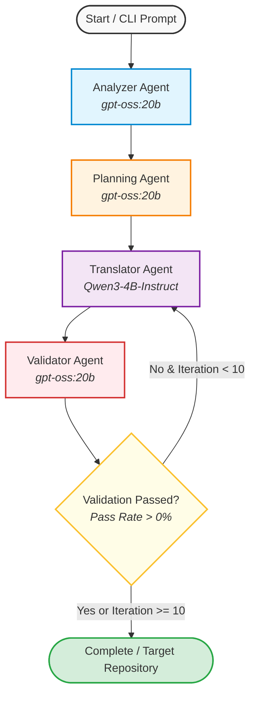
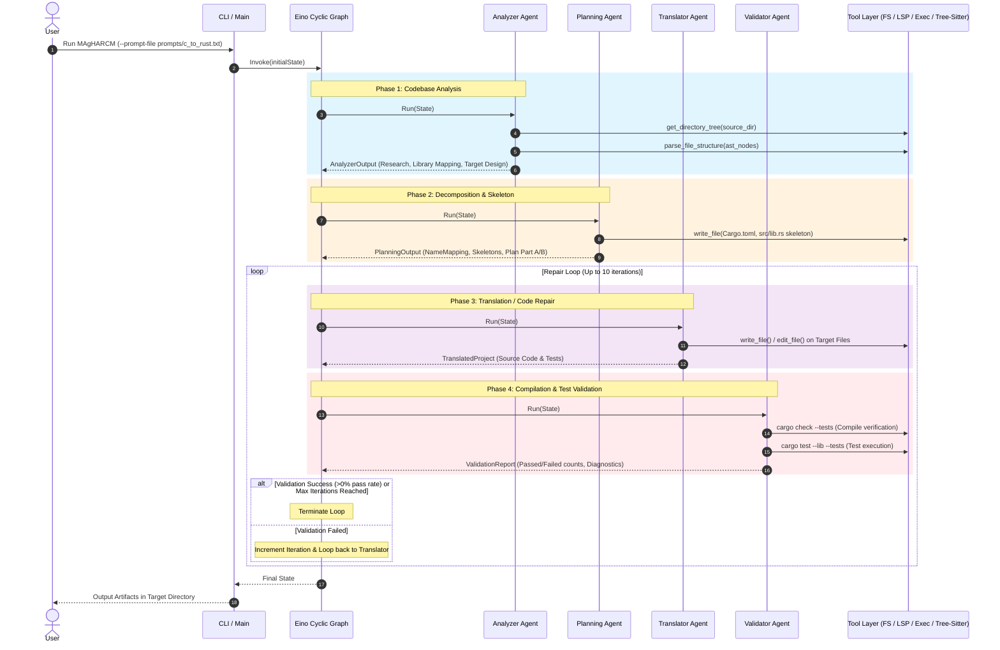

# MAgHARCM Architecture & Workflow

`MAgHARCM` is a multi-agent repository-level code translation system implemented in Go using CloudWeGo Eino, based on the **ReCodeAgent** architecture ([arXiv:2604.07341](https://arxiv.org/abs/2604.07341)).

---

## 1. High-Level Agent Graph

---

## 2. Detailed Dataflow & Tool Interaction

---

## 3. Subsystem Breakdown

### 1. Analyzer Agent (`pkg/agents/analyzer.go`)
- **Model**: `gpt-oss:20b` (Reasoning)
- **Role**: Explores the source directory, parses AST structures (via Tree-sitter for C, C++, Go, Rust), and outputs:
  - Source Project Research
  - Third-Party Library Analysis
  - Target Project Architecture Design

### 2. Planning Agent (`pkg/agents/planning.go`)
- **Model**: `gpt-oss:20b` (Reasoning)
- **Role**: Bridges source AST to target semantics and initializes the target workspace:
  - Symbol Name Mapping (source $\rightarrow$ target)
  - Dynamic Target Skeleton Generation (`Cargo.toml`, module declarations)
  - 2-Part Implementation Plan:
    - **Part A**: Core source module translation
    - **Part B**: Test suite and characterization test translation

### 3. Translator Agent (`pkg/agents/translator.go`)
- **Model**: `Qwen3-4B-Instruct` (Coding)
- **Role**: Generates and iteratively refines target source code and test files:
  - **Initial Translation**: Generates idiomatic, safe target code adhering to the generated plan.
  - **Repair Mode**: Consumes validation diagnostics, compiler errors, and test failure logs to patch target files.

### 4. Validator Agent (`pkg/agents/validator.go`)
- **Model**: `gpt-oss:20b` (Reasoning)
- **Role**: Validates translation output via tool feedback:
  - Runs `cargo check --tests` and `cargo test --lib --tests`.
  - Parses compiler diagnostics and assertion failures.
  - Triggers Coverage-Guided Test Generation if functions lack coverage.
  - Evaluates completion: **compilation success with $>0\%$ test pass rate**.
